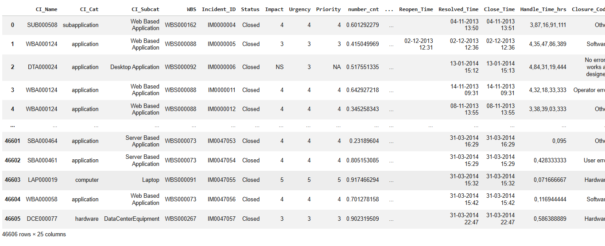
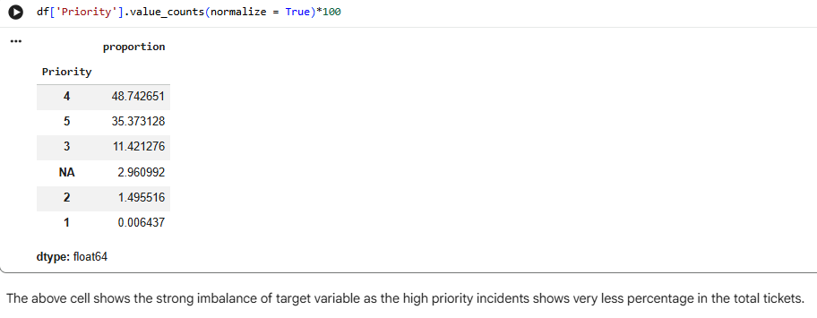
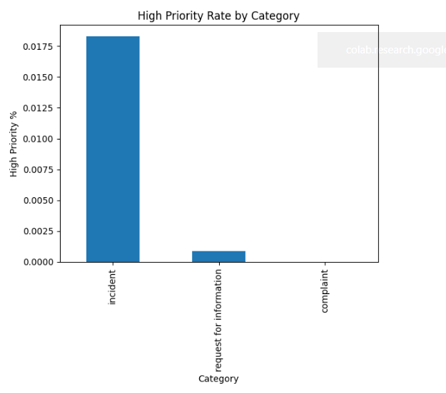
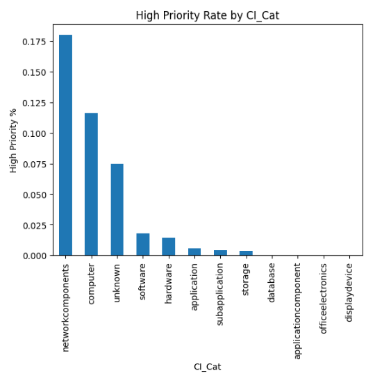
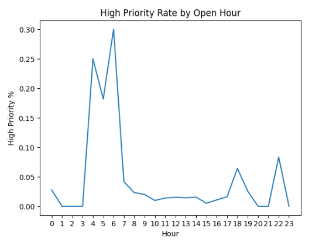
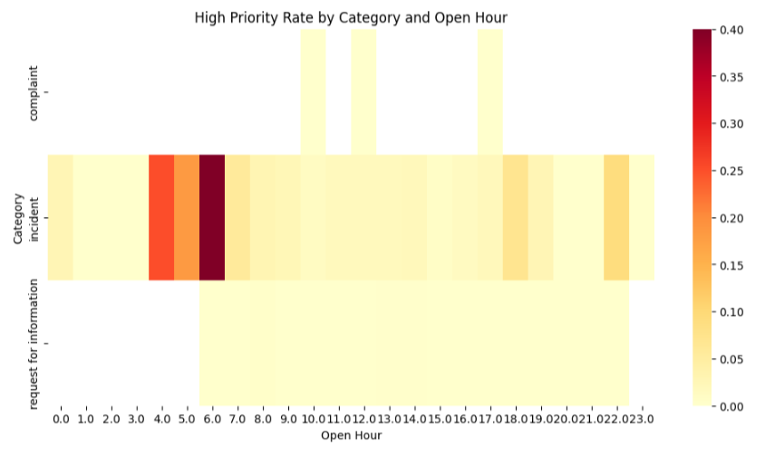
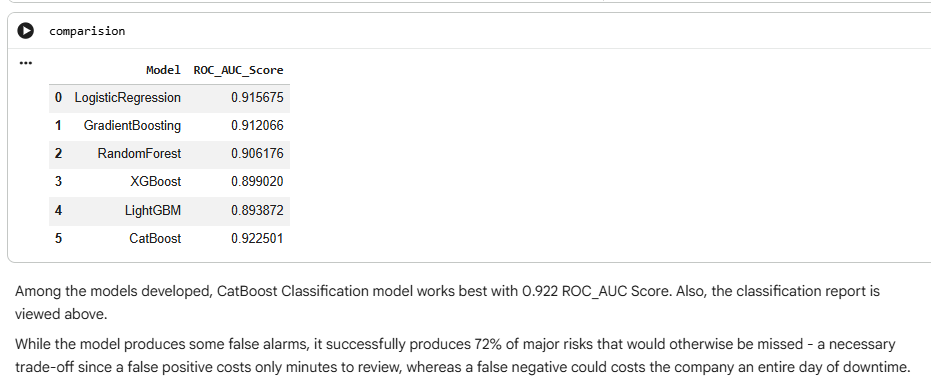
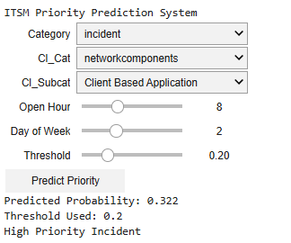

# ITSM Incident Priority Prediction

## Problem Statement
Predict high priority IT incidents to improve service management.

## Business Objective
- Identify critical incidents early
- Reduce resolution time
- Improve customer satisfaction

## Dataset
- 46K records
- Features: CI_Name, Priority, Impact, Urgency, etc.

## ML Approach
- Data Preprocessing
- Exploratory Data Analysis (EDA)
- Model Building using:
  - Logistic Regression
  - Random Forest
  - Gradient Boosting
  - XGBoost
  - LightGBM
  - CatBoost

## Screenshots

### Exploratory Data Analysis (EDA)
Key insights from data such as priority distribution, category analysis, and time-based patterns.

### Model Prediction & Deployment
Comparison of model performance and interactive prediction using ipywidgets.

## Results
- Model predicts priority effectively
- Helps proactive IT management

## Conclusion
The machine learning model successfully predicts high-priority incidents, enabling proactive issue resolution and improving IT service management efficiency.

## Project Structure

ITSM-Incident-Prediction/
│── ITSM.ipynb
│── README.md
│── Images/
│   ├── EDA1.png
│   ├── EDA2.png
│   ├── EDA3.png
│   ├── EDA4.png
│   ├── EDA5.png
│   ├── EDA6.png
│   ├── 7.png
│   ├── 8.png

## Tools Used
- Python
- Pandas
- Scikit-learn
- Matplotlib